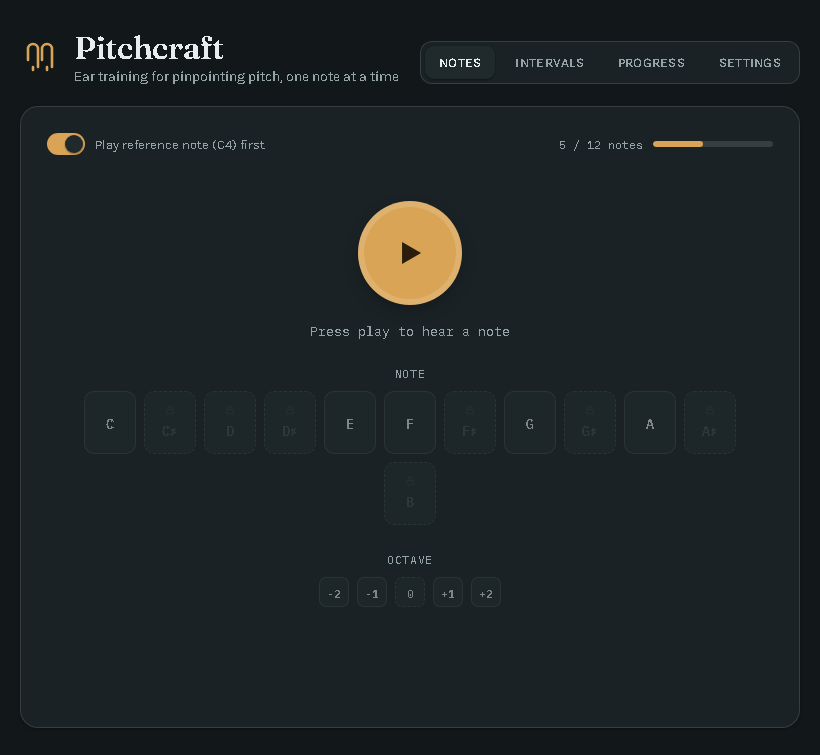
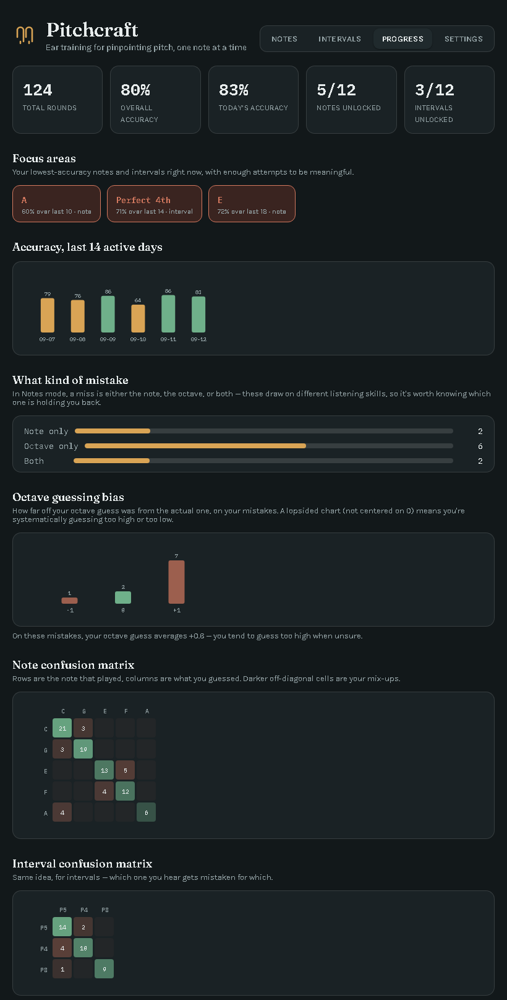

# Pitchcraft

Pitchcraft is a browser-based ear-training app for learning to identify musical notes, octaves, and intervals by ear — no installation, no account, just open the HTML file and play.

It started as a simple "guess the note" quiz and grew into an adaptive trainer with its own progress-analysis system, built to answer one question: *what exactly am I getting wrong, and why?*

## What it does

**Notes mode** — you hear a reference tone (middle C) followed by a target note, then guess both the **note** and the **octave** it played in. Grading only happens once you've picked both, so you can't accidentally skip the harder half of the question. Starting out, only two notes (C and G) are unlocked and the octave stays close to the reference; as your accuracy on the current set climbs past ~85%, new notes unlock one at a time (naturals before sharps) and the octave range you're tested on gradually widens.

**Intervals mode** — same idea, but for the distance between two notes. The root note is randomized every round so you're forced to listen for the *gap* between the notes rather than memorizing a fixed pitch, with intervals unlocking from the easiest (perfect 5th, perfect 4th, octave) up to the hardest (tritone, minor 2nd).

**Progress page** — every wrong answer is logged and broken down so you can see the actual pattern in your mistakes, not just an accuracy percentage:

- **Focus areas** — your three weakest notes/intervals right now
- **Error-type breakdown** — was it the note you got wrong, the octave, or both? (These are genuinely different listening skills.)
- **Octave guessing bias** — a histogram showing whether you systematically guess too high or too low, not just "wrong"
- **Confusion matrices** — for notes and intervals, which one you actually mix up with which
- **Recent mistakes feed** — your last wrong answers in plain language, most recent first

## Screenshots

**Notes mode**, mid-practice with 5 notes unlocked and a widened octave range:

**Progress page**, showing the mistake-analysis breakdown after a few days of practice:

## Running it

There's nothing to build or install. Download [`pitchcraft.html`](pitchcraft.html) and open it in any modern browser (Chrome, Edge, Firefox, Safari) — it's a single self-contained file. Progress is saved to your browser's local storage, so it persists between sessions on the same browser/device.

## How it's built

Plain HTML/CSS/JavaScript, no build step, no dependencies. Tones are generated live with the Web Audio API (plain sine waves — no audio samples), so the whole app is one file.
